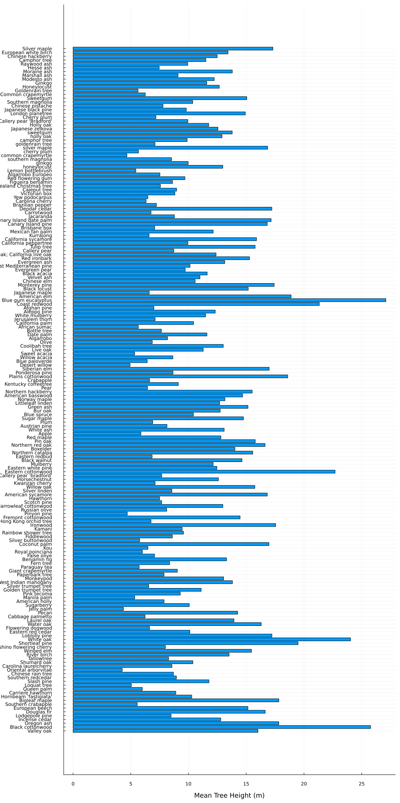
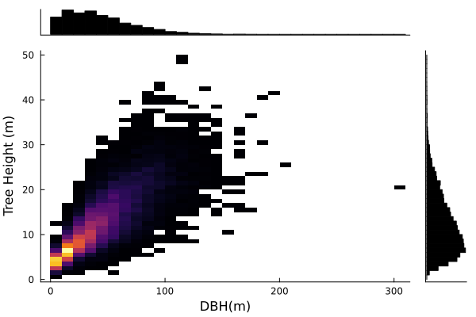
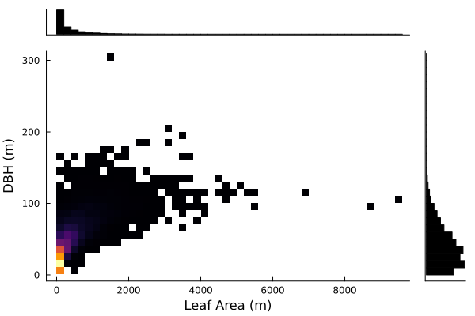
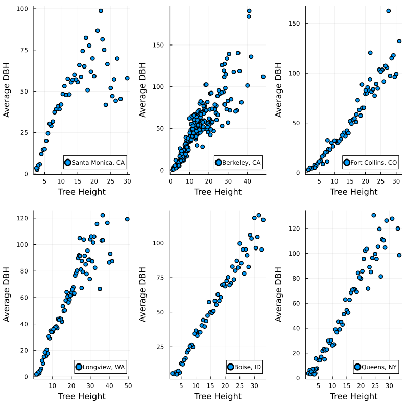
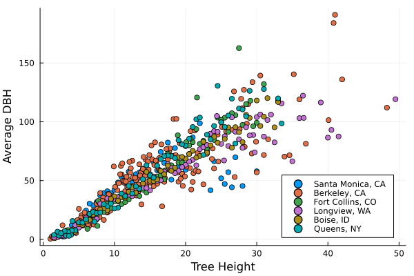

## Exploratory Data Analysis

The following will provide a narrative description and characterization of the tree dataset, interspersed with summary statistics and plots. Throughout this exploratory analysis, four main questions were investigated to guide data exploration:

1. How do power lines impact the growth of trees? (i.e., number of trees, leaf area, tree height, power lines)
2. How does setback (tree distance from heated/airconditioned spaces) show in different cities and/or regions? (i.e., correlation with tree height, leaf size, location)
3. What are the correlations between tree type, land use, height, leaf area, carshade, DBH, CdiaPar, and CDiaPerp for urban tree planning by region and/or city?
4. How does growth rate (i.e., height per age of tree) differ for each region, land use, city, etc.?

For each of these questions, the data was wrangled and filtered to generate visualizations of potential correlations among selected variables of interest.

### Question 1
In this part, the research team were exploring if the presence of utility lines has an impact on the growth of trees. To answer this question, four variables were selected to be analyzed and filtered to find the correlation between the presence of utility lines and the growth of tree that include “WireConf” “Age”, “TreeHt”, and “DBH”. The “WireConf” variable is a categorical variable that presents if the utility lines interfere with or appear above a tree. This variable might include one of five values, 0=no lines, 1=present and no potential conflict, 2=present and conflicting, 3=present and potential for conflicting, and -1 denotes data were not collected. The “Age” variable is a numerical variables that presents number of years since planted. The “TreeHt (m)” variable is a numerical variable that presents tree height from ground to the treetop to the nearest 0.5 m. The “DBH” variable is a numerical variable that presents diameter of tree at breast height (1.37 meters [m]) measured to nearest 0.1 centimeters. 

The first step in our analysis is to group data by “WireConf” to discover how many trees in our database were affected. Figure @fig:numberoftrees shows the percentage of trees in the database in each category after excluding all trees that do not have data, where 1= no lines, 2 = present and no potential conflict, 3 = present and conflicting, and 4 = present and potential for conflicting. It is clear that the majority of the trees are not in areas that have utility lines conflicting with trees which will help the research team to examine the growth of trees when there are no utility lines and compare it with the growth of trees when utility lines are present.

{#fig:numberoftrees width=5in}

The second step is to calculate the average height of trees for each of the aforementioned categories as shown in Figure @fig:averegeheight .  The average tree height in all categories is varies from 10 to 13 meters which does not clarify the impact of the growth of tree with the present of the utility line. Therefore, further investigation is needed.

{#fig:averegeheight width=5in}

The third step is to find the correlation between the age of trees and the height for each of the aforementioned categories, as shown in  Figure @fig:h_avgHeight_age. It is clear that there is a strong correlation between tree age and average tree height in all categories. The calculated correlation in all categories is higher than 0.7. Additionally, in all categories, the correlation is almost the same under the age of 50 years then, it started to be slightly different as shown in  Figure @fig:h_avgHeight_age_all.

{#fig:h_avgHeight_age width=7.5in}

{#fig:h_avgHeight_age_all width=6in}

The fourth step is to analyze the correlation between the average diameter of tree and its age in each category. Figure @fig:h_avgDBH_age shows that there is a strong correlation between the average DBH and tree age in all categories. The calculated correlation in all categories is higher than 0.8, see Figure @fig:h_avgDBH_age_all.

{#fig:h_avgDBH_age width=7.5in}

{#fig:h_avgDBH_age_all width=6in}

The last step is to find the correlation between the height and diameter of trees to see if the research team can use that in estimating the height of trees based of its diameter. Figure @fig:h_cor_age_avgDBH present the correlation between the two aforementioned variables. It is clear that there is a strong correlation between tree height and its diameter. The calculated correlation is 0.78. 

{#fig:h_cor_age_avgDBH width=6in}

Therefore, it is clear that the present of utility line does not have a great impact on the growth of trees. However, the research team has found that there is a strong correlation between tree age and both height and diameter of tree that can be used in developing a regression model that can predict the age of trees based on their height and diameter.   

### Question 2

### Question 3

Next, the relationships among tree species, tree height, land use, and location were explored to identify any plausible correlations for the purpose of urban tree planning. One may consider how urban city planners select particular species of tree to plant within specific land use types. For example, perhaps an urban planner might select a particular tree species based on average height or canopy size (leaf area) in order to provide suitable landscaping along a street to provide sufficient shade to city goers without interscepting overhead telephone lines or buildings. [Site from evidence]. Furthermore, these data were grouped by city and region to investigate spatial differences among the variables. Perhaps southern California cities like Santa Monica plant different trees compared to those in Boise, Idaho for different purposes. The following visualizations were produced to study these qualitative and quantitative relationships. 

First, a barplot of tree heights grouped by species was produced over all locations to study typical heights associated with each tree type. From Fig. @fig:E_TreeHt_Species_barplot, one can observe how some trees (i.e., blue gum eucalyptus, valley oak) present the highest tree heights compared to others, such as the common crapemyrtle or the pinyon pine, which present much smaller heights. City planners might use this information to decide on which trees to include in their city landscape plans depending on whether short or tall trees would best suit their site.

{#fig:E_TreeHt_Species_barplot width=5in}

Secondly, barplots of tree height by city and region were investigated to develop a deeper understanding of spatial tree height distributions. The following figures present how the average tree height varies by city and region.

{#fig:E_TreeHt_City_barplot width=5in}

{#fig:E_TreeHt_Region width=5in}

Thirdly, a barplot depicting the average land use (which was calculated by rounding the mean land use type across species, where land use contains the following categories: 1=single family residential, 2=multi-family residential, 3=industrial/institutional/large commercial, 4=park/vacant/other, 5=small commercial, 6=transportation corridor) was created to visualize which species might be more commonly associated with a land use type. Based on the results in Fig. @fig:E_MeanLandUse_Species_barplot, it appears that some tree species are more frequently linked to specific land use types (i.e., evergreen ash trees to small/commercial land uses or both willow acacia and japanese maple to single family residential land uses).

{#fig:E_MeanLandUse_Species_barplot width=5in}

Additionally, the correlations among tree height, DBH, crown height, and leaf area were further explored to illustrate quantitative factors that urban planners might consider when redesigning a site. Moreover, the US Forest Service Research Archives, from which the raw tree data was obtained, describes how variables such as tree age can be used to predict a species diameter at breast height (dbh), which can in turn predict tree height, crown diameter, crown height, leaf area, and tree age (https://data.nal.usda.gov/dataset/urban-tree-database) [note: citations will be updated formally!]. Extending the investigation to include these considerations, tree height, DBH, crown height, and leaf area variables were selected and their correlations were calculated. The following graphs depict marginal histograms, which are useful in explaining the distributions of each variable as well as how they are correlated.

{#fig:E_MargHist_DBH_Ht width=5in}

{#fig:E_MargHist_DBH_CrownHt width=5in}

{#fig:E_MargHist_LeafArea_DBH width=5in}

{In depth explanation of above:}

Finally, to investigate these correlations further, average DBH by tree heights were grouped by cities to illustrate how the two variables are related in different cities. The following figures visualize these relationships and show a moderate-to-strong positive correlation between average DBH and tree height across different cities. Several cities were randomly chosen out of all available cities. The correlations between average DBH and tree height are also listed below.

{#fig:E_TreeHt_AvgDBH_CitiesSubplots_Scatter width=5in}

{#fig:E_TreeHt_AvgDBH_Cities_Scatter width=5in}

Correlation Coefficients
- DBH vs Tree Height Overall: 0.8023385455282306
-   Santa Monica, CA: 0.7132638836192362
-   Berkeley, CA: 0.8886494827638055
-   Fort Collins, CO: 0.959599952400562
-   Longview, WA: 0.9334828561163339
-   Boise, ID: 0.9853443320647175
-   Queens, NY: 0.9702645394292799
- Leaf Area vs DBH: 0.7132638836192362
- DBH vs Crown Base Height: 0.42209722299954183

{Wrap up}

### Question 4

{#fig:Ri_Sweetgum_GrowthRate}

This figure shows that Longview, WA trees are taller than Modesto, CA trees at any age.

{#fig:Ri_Cherry_hiVSage}

This figure shows that Longview, WA trees are taller than Modesto, CA trees at any age.

{#fig:Ri_Euro_hiVSage}

This figure shows that Longview, WA trees are taller than Modesto, CA trees at any age.

{#fig:Ri_Euro_GrowthRate}

This figure shows that the growth rate is not constant for one tree type, and may vary for the age of the tree or the time at which the tree was planted. Here it can be seen that generally the growth rate in Longview, WA is greater than that of Modesto, CA

These figures show that there is a relationship between location and height of trees. This relationship may be because of temperature, precipitation, or other factors outside of the dataset. Some variables within this dataset that may affect tree height are explored in this section, and include: setback of trees from conditioned spaces, wire interference, and...