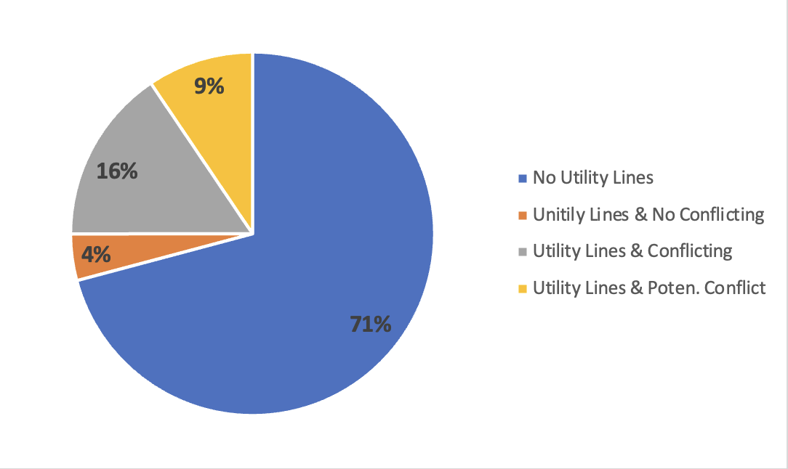
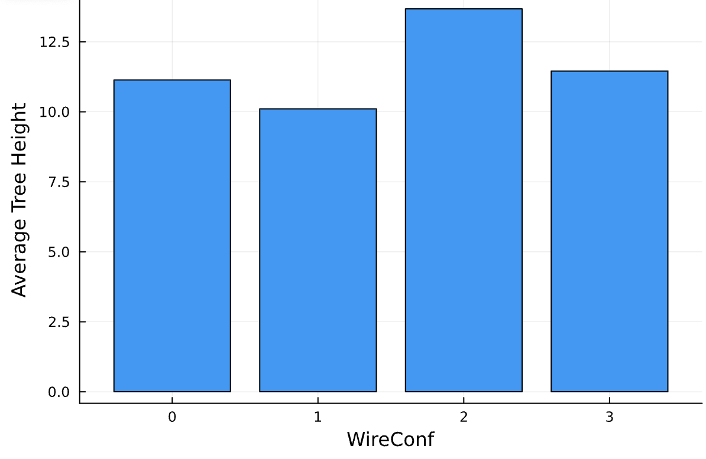
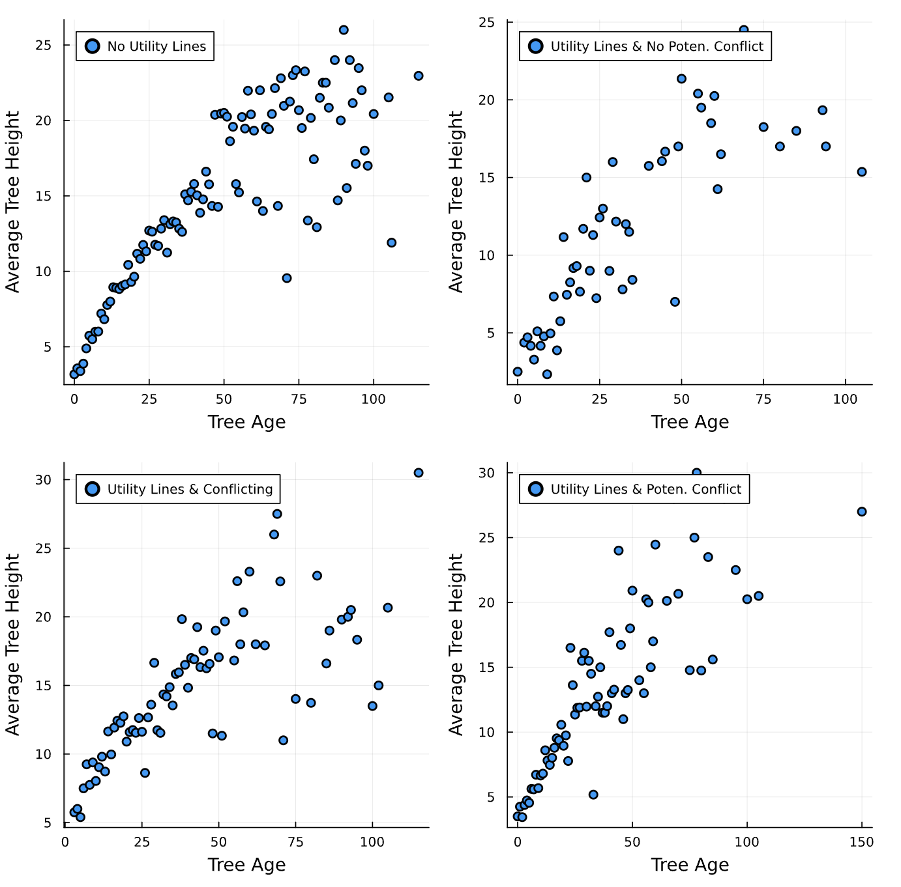
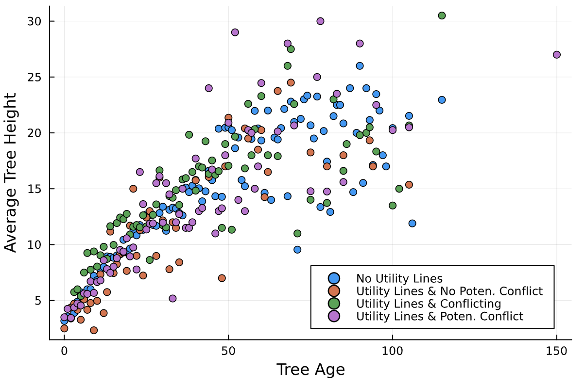
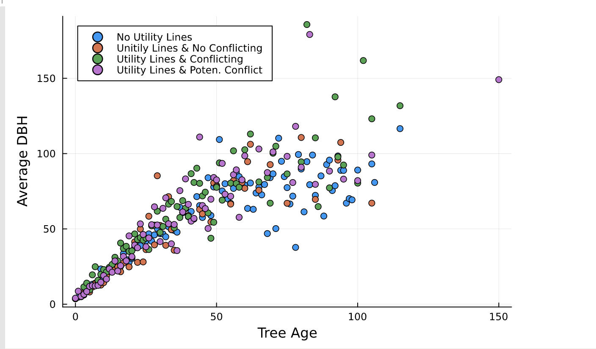
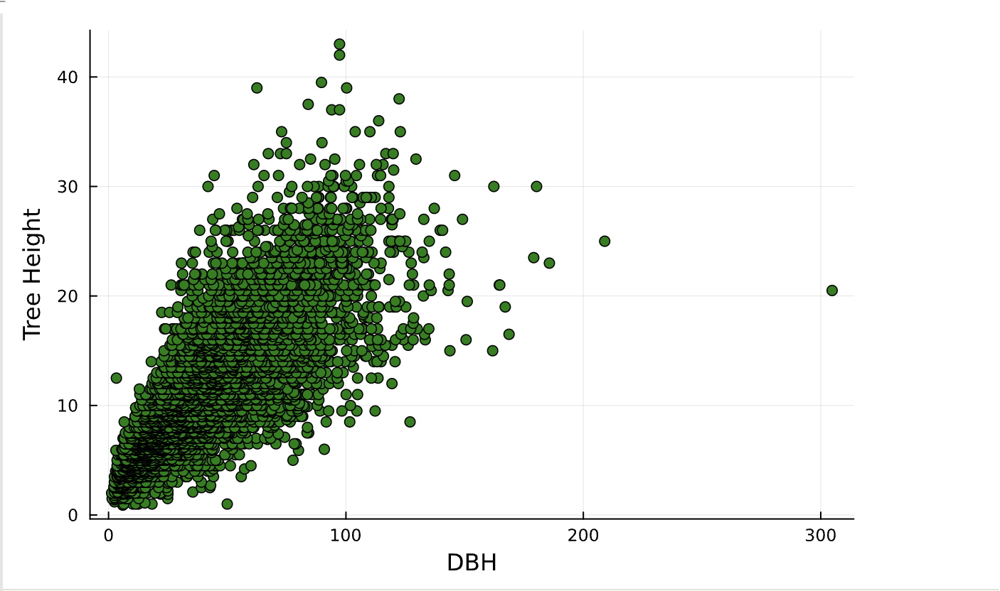
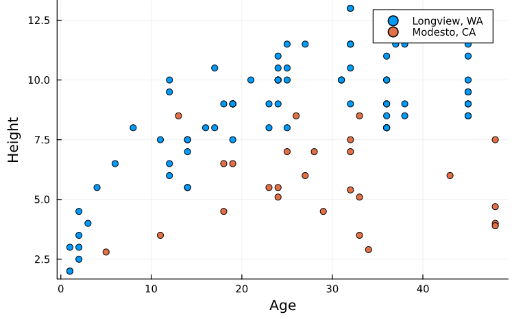
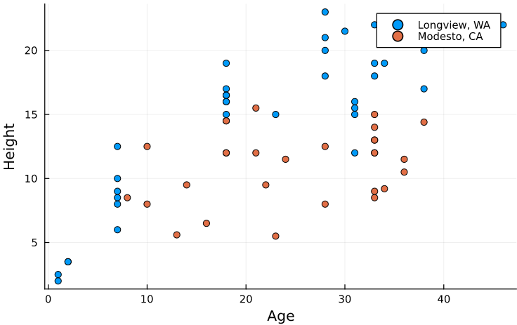
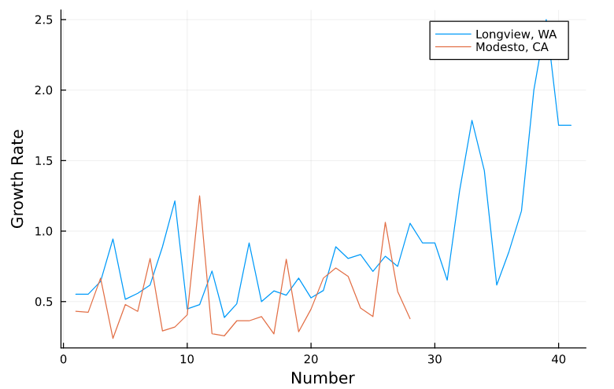

## Exploratory Data Analysis

The following will provide a narrative description and characterization of the tree dataset, interspersed with summary statistics and plots. Throughout this exploratory analysis, four main questions were investigated to guide data exploration:

1. How do power lines impact the growth of trees? (i.e., number of trees, leaf area, tree height, power lines)
2. How does setback (tree distance from heated/airconditioned spaces) show in different cities and/or regions? (i.e., correlation with tree height, leaf size, location)
3. What are the correlations between tree type, land use, height, leaf area, carshade, DBH, CdiaPar, and CDiaPerp for urban tree planning by region and/or city?
4. How does growth rate (i.e., height per age of tree) differ for each region, land use, city, etc.?

For each of these questions, the data was wrangled and filtered to generate visualizations of potential correlations among selected variables of interest.

### Question 1
In this part, the research team were exploring if the presence of utility lines has an impact on the growth of trees. To answer this question, four variables were selected to be analyzed and filtered to find the correlation between the presence of utility lines and the growth of tree that include “WireConf” “Age”, “TreeHt”, and “DBH”. The “WireConf” variable is a categorical variable that presents if the utility lines interfere with or appear above a tree. This variable might include one of five values, 0=no lines, 1=present and no potential conflict, 2=present and conflicting, 3=present and potential for conflicting, and -1 denotes data were not collected. The “Age” variable is a numerical variables that presents number of years since planted. The “TreeHt (m)” variable is a numerical variable that presents tree height from ground to the treetop to the nearest 0.5 m. The “DBH” variable is a numerical variable that presents diameter of tree at breast height (1.37 meters [m]) measured to nearest 0.1 centimeters. 

The first step in our analysis is to group data by “WireConf” to discover how many trees in our database were affected. Figure @fig:numberoftrees shows the percentage of trees in the database in each category after excluding all trees that do not have data, where 1= no lines, 2 = present and no potential conflict, 3 = present and conflicting, and 4 = present and potential for conflicting. It is clear that the majority of the trees are not in areas that have utility lines conflicting with trees which will help the research team to examine the growth of trees when there are no utility lines and compare it with the growth of trees when utility lines are present.

{#fig:numberoftrees}

The second step is to calculate the average height of trees for each of the aforementioned categories as shown in Figure @fig:averege height  The average tree height in all categories is varies from 10 to 13 meters which does not clarify the impact of the growth of tree with the present of the utility line. Therefore, further investigation is needed.

{#fig:averege height}

The third step is to find the correlation between the age of trees and the height for each of the aforementioned categories, as shown in  Figure @fig:h_avgHeight_age. It is clear that there is a strong correlation between tree age and average tree height in all categories. The calculated correlation in all categories is higher than 0.7. Additionally, in all categories, the correlation is almost the same under the age of 50 years then, it started to be slightly different as shown in  Figure @fig:h_avgHeight_age_all.

{#fig:h_avgHeight_age}

{#fig:h_avgHeight_age_all}

The fourth step is to analyze the correlation between the average diameter of tree and its age in each category. Figure @fig:h_avgDBH_age shows that there is a strong correlation between the average DBH and tree age in all categories. The calculated correlation in all categories is higher than 0.8. Additionally, in all categories, the correlation is almost the same under the age of 50 years then, it started to be slightly different as shown in Figure @fig:h_avgDBH_age_all.

{#fig:h_avgDBH_age}

{#fig:h_avgDBH_age_all}

The last step is to find the correlation between the height and diameter of trees to see if the research team can use that in estimating the height of trees based of its diameter. Figure 7 shows that there is a strong correlation between them. Figure @fig:h_cor_age_avgDBH present the correlation between the two aforementioned variables. It is clear that there is a strong correlation between tree height and its diameter. The calculated correlation is 0.78. 

{#fig:h_cor_age_avgDBH}

Therefore, it is clear that the present of utility line does not have a great impact on the growth of trees. However, the research team has found that there is a strong correlation between tree age and both height and diameter of tree that can be used in developing a regression model that can predict the age of trees based on their height and diameter.   

### Question 2

### Question 3

Relationships among tree species, land use, leaf area, height, and shade were explored to identify any plausible correlations among the variables for the purpose of urban tree planning. It was intially considered that urban city planners may select particular species of tree to plant within specific land use types, and perhaps those tree species were chosen based on average height or canopy size (leaf area) characteristics. For example, an urban planner might choose a specific tree type (i.e., species) for its wide canopy and shorter height to provide shade to automobiles parked along a street without interscepting overhead telephone lines or buildings. [Site from evidence] The following visualizations were produced to study these relationships. 

[insert images]
(images/E_TreeHt_City_barplot.png)

As shown in the above visualizations [insert narrative descriptions here for overall graphs from this question]

Additionally, the relationships among tree height, DBH, CdiaParm and CDiaPerp were further explored. The US Forest Service Research Archives, from which the raw tree data was obtained, describes how variables such as tree age can be used to predict a species diameter at breast height (dbh), which can in turn predict tree height, crown diameter, crown height, leaf area, and tree age (https://data.nal.usda.gov/dataset/urban-tree-database) [note: citations will be updated formally!]. Thus, these variables were chosen to further investigate potential correlations. 

### Question 4

{#fig:Sweetgum}
This figure shows that Longview, WA trees are taller than Modesto, CA trees at any age.

This figure shows that Longview, WA trees are taller than Modesto, CA trees at any age.

This figure shows that Longview, WA trees are taller than Modesto, CA trees at any age.

This figure shows that the growth rate is not constant for one tree type, and may vary for the age of the tree or the time at which the tree was planted. Here it can be seen that generally the growth rate in Longview, WA is greater than that of Modesto, CA

These figures show that there is a relationship between location and height of trees. This relationship may be because of temperature, precipitation, or other factors outside of the dataset. Some variables within this dataset that may affect tree height are explored in this section, and include: setback of trees from conditioned spaces, wire interference, and...