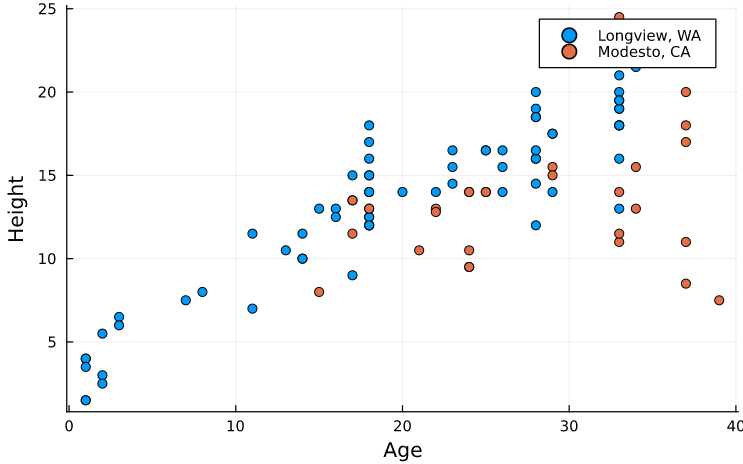
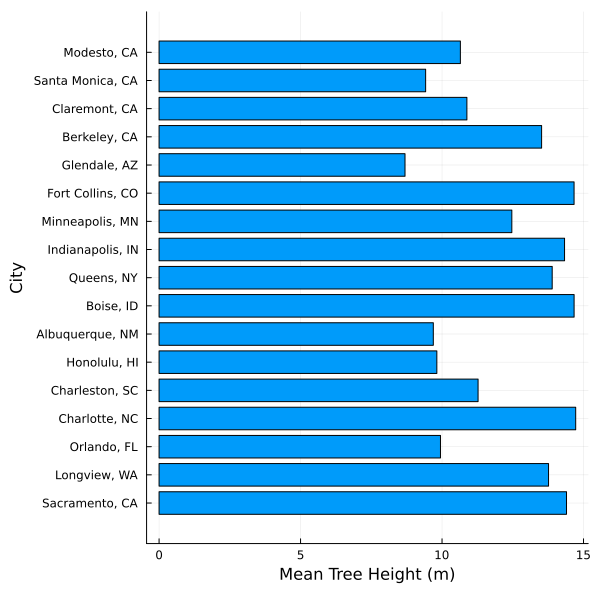
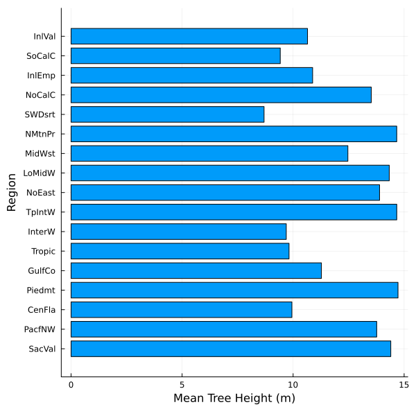
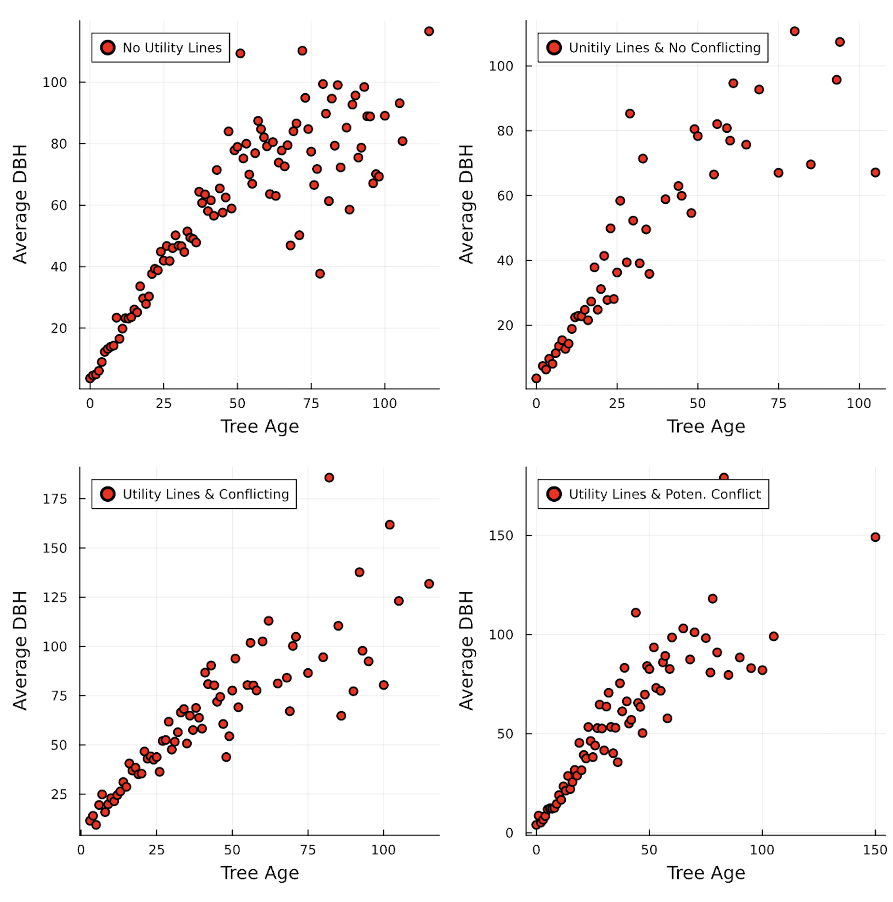

## Exploratory Data Analysis

Tree growth depends on many factors, some of which are included in this dataset, while others are outside the scope of this work. Resulting from the following data analysis, different regions were found to have trees of the same species and ages, but variable heights. This can be attributed to climate specific variables such as yearly temperature, precipitation, flooding, and even wind speeds (Source 1). Variables within the scope of this project that could have an impact on tree growth include: power line interference, setback from conditioned spaces, and land use. Additionally, variables describing tree growth such as diameter at breast height, leaf volume, tree height, and tree age also depend on one another (Source 2, 3).
Throughout this exploratory analysis, four main questions were developed to guide data exploration, which involved data wrangling to produce visualizations of potential correlations among selected variables of interest. These questions are as follows:
1. How does setback (tree distance from heated/air-conditioned spaces) show in different cities and/or regions? (i.e., correlation with tree height and location)
2. How does growth rate (i.e., height per age of tree) differ for each region, land use, city, etc.?
3. How do power lines impact the growth of trees? (i.e., number of trees, leaf area, tree height, power lines)
4.  What are the correlations between tree type, land use, height, leaf area, car shade, DBH, CdiaPar, and CDiaPerp for urban tree planning by region and/or city? 

Initially, setback was investigated to understand the effects it has on the height of trees. Setback is defined as the distance from the tree to the nearest air-conditioned or heated space (which may not be the same address as the tree location), with values of 1,2,3,4, which are defined as 0m to 8m, 8.1m to 12m, 12.1m to 18m, and > 18m, respectively. . After filtering out all the missing values from the dataset, a bar graph was plotted for the mean setback across various locations.(Figure @fig:fig:Ru_Mean_setback_cropped)

{#fig:Ru_Mean_setback_cropped width=5in}

It was identified that the cities with the highest mean setback (in descending order) are: 1) Albuquerque (3.80385), 2) Glendale (3.56843), 3) Charlotte (3.06892), 4) Longview (2.92153) Similarly, the cities with least mean setback were (in ascending order) : 1) Queens (2.01564), 2) Claremont (2.17143), 3) Berkeley (2.28313), 4) Indianapolis (2.31699)
Next, similar tree species from the top four mean setback values and bottom four mean setback values were identified. This helped to establish a similar medium for tree height comparison. However, it was found that no common species were present between the two groups. Therefore, a random city (Charlotte) was analyzed, where similar species having the same age were grouped together.

{#fig:Ru_SilverMaple_age35_setback_2-3 width=5in}

{#fig:Ru_RiverBirch_age15_setback_3-4 width=5in}

Using their mean heights, it was observed that setback and tree height presented no correlation as seen in the following 2 cases:
1) Silver Maple trees of age 35 with Setback of 2 and 3 (Figure @fig:Ru_SilverMaple_age35_setback_2-3)
2) River Birch trees of age 15 with Setback of 3 and 4 (Figure @fig:Ru_RiverBirch_age15_setback_3-4)

Next, the tree height parameter was explored by selecting two random cities - Longview, WA and Modesto, CA, and the species that were selected due to their existence in both locales were - Sweetgum, Cherry Plum, and European White Birch. 

{#fig:Ri_Sweetgum_GrowthRate width=5in}

This figure shows that Longview, WA Sweetgum trees are taller than Modesto, CA trees at any age.

{#fig:Ri_Cherry_hiVSage width=5in}

This figure shows that Longview, WA Cherry Plum trees are taller than Modesto, CA trees at any age.

{#fig:Ri_Euro_hiVSage width=5in}

This figure shows that Longview, WA European Birch trees are taller than Modesto, CA trees at any age.

Next, the growth rate (Tree Height / Age) vs Tree ID yielded the following graph:

{#fig:Ri_Euro_GrowthRate width=5in}

This figure shows that the growth rate is not constant for one tree type, and may vary throughout the tree's lifetime. Here it can be seen that generally, the growth rate in Longview, WA is greater than that of Modesto, CA.

These figures illustrate a relationship between location and height of trees. This relationship may be attributed to different temperature, precipitation, or other factors outside of the dataset.

To further understand the differences for tree height across all the locations in the dataset, a barplot of tree heights grouped by species was produced over all locations to study typical heights associated with each tree type. From Fig @fig:E_TreeHt_Species_barplot, one can observe how some trees (i.e., blue gum eucalyptus, valley oak) present the highest tree heights compared to others, such as the common crapemyrtle or the pinyon pine, which present much smaller heights. City planners might use this information to decide which trees to include in their city landscape plans.

{#fig:E_TreeHt_Species_barplot width=5in}

Then, barplots of tree height by city and region were investigated to develop a deeper understanding of spatial tree height distributions. The following figures present how the average tree height varies by city and region.

{#fig:E_TreeHt_City_barplot width=5in}

{#fig:E_TreeHt_Region width=5in}

From these figures, it can be observed that there are distinct spatial differences among tree height distributions. For example, trees tend to be taller in more mountainous regions and shorter in desert regions, and this aligns well with the results observed in Fort Collins, CO and Albuquerque, NM, respectively.

Moreover, an exploration of the presence of utility lines and their impact on the growth of trees was conducted. For this analysis, four variables were selected and filtered to find the correlation between the presence of utility lines and the growth of trees. These variables include “WireConf”,  “Age”, “TreeHt”, and “DBH”. The “WireConf” variable is a categorical variable that presents whether the utility lines interfere with or appear above a tree. This variable might include one of five values: 0= no lines, 1= lines present and with no potential conflict, 2= lines present and conflicting, and 3= lines present with potential for conflicting, while any values with “-1” denote data that was not collected. The “Age” variable is a numerical variable that presents the number of years since the tree was planted. The “TreeHt (m)” variable is a numerical variable that presents tree height from ground to the treetop to the nearest 0.5 m. The “DBH” variable is a numerical variable that presents the diameter of the tree at breast height (1.37 meters [m]) measured to the nearest 0.1 centimeters.

The first step in analyzing the effect of wire conflict on the dataset was to group the data by “WireConf” to discover how many trees in the database were affected. Figure @fig:numberoftrees shows the percentage of trees in the database in each category after excluding all trees that do not have data.  Figure @fig:numberoftrees shows that 71% of trees in the database are not in areas that have utility lines conflicting with them, which will help to compare tree growth when no utility lines are present vs when utility lines are present. 

{#fig:numberoftrees width=5in}

The second step is to calculate the average height of trees for each of the aforementioned categories as shown in Figure @fig:averegeheight. The average tree height in all categories varies from 10 to 13 meters, which does not clarify the impact of the growth of trees with the presence of the utility lines. Therefore, further investigation is needed.

{#fig:averegeheight width=5in}

The third step is to find the correlation between the age and the height of trees for each of the aforementioned categories. Figure @fig:h_avgHeight_age shows that there is a strong correlation between tree age and average tree height in all categories. The calculated correlation in all categories is higher than 0.7.  Additionally, in all categories, the correlation is almost the same under the age of 50 years then, it started to be slightly different in each category as shown in Figure @fig:h_avgHeight_age_all. 

{#fig:h_avgHeight_age width=7.5in}

{#fig:h_avgHeight_age_all width=6in}

The fourth step is to analyze the correlation between the average diameter of a tree and its age in each category. Figure @fig:h_avgDBH_age shows that there is a strong correlation between the average DBH and tree age in all categories. The calculated correlation in all categories is higher than 0.8, see Figure @fig:h_avgDBH_age_all.

{#fig:h_avgDBH_age width=7.5in}

{#fig:h_avgDBH_age_all width=6in}

The last step is to find the correlation between the height and diameter of trees to validate its use in estimating the tree height based on its diameter. Figure @fig:h_cor_age_avgDBH presents the correlation between the two aforementioned variables. The figure shows a strong correlation between tree height and its diameter, and the calculated correlation is 0.78.

{#fig:h_cor_age_avgDBH width=6in}

Therefore, the presence of utility lines does not have a great impact on the growth of trees. Next, the relationships among tree species, tree height, land use, and location were explored to identify any plausible correlations for the purpose of urban tree planning. One may consider how urban city planners select particular species of tree to plant within specific land use types. For example, perhaps an urban planner might select a particular tree species based on average height or canopy size (leaf area) in order to provide suitable landscaping along a street and provide sufficient shade to city goers without intercepting overhead telephone lines or buildings. Furthermore, these data were grouped by city and region to investigate spatial differences among the variables. 

Next, a bar plot depicting the average land use (which was calculated by rounding the mean land use type across species, where land use contains the following categories: 1=single family residential, 2=multi-family residential, 3=industrial/institutional/large commercial, 4=park/vacant/other, 5=small commercial, 6=transportation corridor) was created to visualize which species might be more commonly associated with a land use type. Based on the results in Fig. @fig:E_MeanLandUse_Species_barplot, it appears that some tree species are more frequently linked to specific land use types (i.e., evergreen ash trees to small/commercial land uses or both willow acacia and japanese maple to single family residential land uses).

{#fig:E_MeanLandUse_Species_barplot width=5in}

Additionally, the correlations among tree height, DBH, crown height, and leaf area were explored to illustrate quantitative factors that urban planners might consider when redesigning a site. Moreover, the US Forest Service Research Archives, from which the raw tree data was obtained, describes how variables such as tree age can be used to predict a species diameter at breast height (dbh), which can in turn predict tree height, crown diameter, crown height, leaf area, and tree age [2]. Extending the investigation to include these considerations, tree height, DBH, crown height, and leaf area variables were selected and their correlations were calculated. The following graphs depict marginal histograms, which are useful in explaining the distributions of each variable as well as how they are correlated.

{#fig:E_MargHist_DBH_Ht width=5in}

{#fig:E_MargHist_DBH_CrownHt width=5in}

{#fig:E_MargHist_LeafArea_DBH width=5in}

To investigate these above relationships further, average DBH by tree heights were grouped by cities to illustrate how the two variables are related in different cities. The following figures visualize these relationships and show a moderate-to-strong positive correlation between average DBH and tree height across different cities. Several cities were randomly chosen out of all available cities. The correlations between average DBH and tree height are also listed below.

{#fig:E_TreeHt_AvgDBH_CitiesSubplots_Scatter width=5in}

{#fig:E_TreeHt_AvgDBH_Cities_Scatter width=5in}

Correlation Coefficients:
1) DBH vs Tree Height Overall: 0.802
2) DBH vs Tree Height for randomly chosen cities:
    Santa Monica, CA: 0.713
    Berkeley, CA: 0.889
    Fort Collins, CO: 0.959
    Longview, WA: 0.933
    Boise, ID: 0.985
    Queens, NY: 0.970
    Leaf Area vs DBH: 0.713
3) DBH vs Crown Base Height: 0.422

In summary, this exploratory analysis has shown both strong and insignificant correlations among raw tree data variables. The relationship between tree height and setback revealed insignificant correlation , while moderate-to-strong correlations between tree age and both height and diameter of tree exist. Additionally, correlation between tree age and its diameter is stronger than that of tree age and height. Overall, relationships among tree size and tree growth are significant because they can be used by urban forest managers, landscape architects, and city planners to select suitable trees given limited growing space or an intended purpose. Predicting the most suitable trees for a site has the potential to reduce costly future conflicts between trees and infrastructure [2]. 