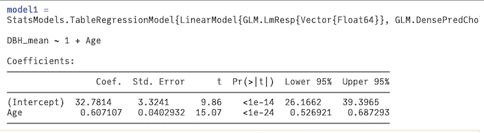

## Predictive Modeling

Based on some of the above correlations and supporting evidence from the US Forest Service Research Archives [2], there are strong correlations among diameter at breast heights (dbh) and tree age, tree height, leaf area, crown height, and average crown diameter. 
Therefore, several predictive models using 3 different machine learning techniques were explored to select the most suitable model to predict dbh based on the aforementioned variables. Those techniques include (1) decision-tree algorithm, (2) regression, and (3) neural networks. To enable a reliable performance evaluation procedure, the collected data was divided into two separate datasets for each developed predictive model: (1) training dataset that includes 70% of all the available data that will be used in developing the model, and (2) testing dataset that includes 30% of all available data that will be used for evaluating the performance of the developed model. The following three sections provide a detailed description of these aforementioned 3 machine learning techniques.

### Decision-Tree Algorithm 

A regression decision tree model was run with two, three, four, and five independent variables in order to predict DBH. The output of these iterations are shown in Figure @fig:DECtree_Table :

{#fig:DECtree_Table width=6in}

With each addition of independent variables, the mean coefficient of determination increased, and the mean squared error decreased. But overall, the decision tree model for this data is not robust and does not do a great job at fitting the data. The correlation coefficient gets increasingly closer to one with additional variables, meaning the linear relation is better with more variables and DBH than a few variables and DBH. This finding shows that a linear regression model might be a better method for modeling this dataset.

A classification decision tree was also tested to see if the tree type could be predicted using crown height, age, DBH, and tree height. This model was run with three folds similarly to the previous decision tree. The resulting model had very low accuracy of 0.369198, 0.377247, and 0.376442. These values of accuracy suggest that predicting tree type in this manner is not reliable.

### Regression

This technique depends on developing multiple linear regression models among a dependent variable and independent variables. Aiming to improve the performance of a predictive model, we constructed a simple regression model that uses one independent variable (tree age) to predict the dependent variable (average dbh). To visualize the model performance, we calculated the coefficient of determination, Root Mean Square Error (RMSE), and model accuracy. As shown in Figure @fig:Reg_model1, the model achieved an R-squared of 74%, RSEM of 21.12, and a lpw accuracy of 12.4%. 

{#fig:Reg_model1 width=5in}

We investigated further to find an explanation for the model's poor performance. We plotted the average dbh in the y-axis and age in the x-axis to visualize the training and testing datasets. We noticed that two data points were outliers, as shown in Figure @fig:Reg_model1_plot.

{#fig:Reg_model1_plot width=5in}

A second model was performed using the same dependent and independent variables after excluding the outliers. These two outliers were tree ages above 200 years. The model achieved an R-squared of 88%, RMSE of 10.91, and accuracy of 87%, as shown in Figure @fig:Reg_Model2.

{#fig:Reg_Model2 width=6in}

A third model was performed using two independent variables instead of one: tree age and average tree height. This model achieved an R-squared of 94%, RMSE of 8.08, and accuracy of 92%, as shown in Figure @fig:Reg_Model3.

{#fig:Reg_Model3 width=6in}

A fourth model was performed using three independent variables: tree age, average tree height, and average leaf area. The model achieved an R-squared of 95%, RMSE of 9.01, and accuracy of 92%, as shown in Figure @fig:Reg_Model4.

{#fig:Reg_Model4 width=6in}

The fifth model was performed using four independent variables: tree age, average tree height, average leaf area, and average crown diameter. The model achieved an R-squared of 93%, RMSE of 7, and accuracy of 94.5%, as shown in Figure @fig:Reg_Model5.

{#fig:Reg_Model5 width=6in}

Based on the above analysis, the best model that achieved the lowest RMSE and highest accuracy was Model 5.

### Neural Network
This final technique involves two main approaches. The first builds a simple linear regression neural network of one tree characteristic input to one tree characteristic output. First, the tree data was filtered into "DBH", "TreeHt", "Age", and "CrnBase." Then, "DBH" was chosen as the input variable and "TreeHt" was selected as the output or dependent variable for prediction. The observations in the dataframe were then shuffled to prepare for splitting the dataset into 50% training and 50% testing data. Following the splitting and reshaping of the data, a linear regression neural network was constructed using the Julia Flux package, one dense layer with one input and one output channel, gradient descent as the optimization approach, and a mean square error (MSE) loss function. After running through 12 epochs or iterations, the neural net predicted 88% of tree heights from given DBH values. The RSME associated with this model was roughly 13.8. This model performance was relatively decent compared to other models, but it was still insufficient to generate valid predictions. 

Moving on to a more complex neural network, the second technique tackled more input or independent variables to predict tree species. After isolating relevant tree characteristic input features such as "TreeType", "Age", "DBH", "TreeHt", "CrnBase", "CrnHt", "CdiaPar", "CDiaPerp", "AvgCdia", and "Leaf" and filtering out unwanted missing data, the neural net was structured to predict tree species, or "CommonName." 157 unique tree species names were identified, and these were manipulated to create unique integer indeces mapped to each unique "CommonName." Following appropriate reshaping and data re-structuring to meet the required input format in the Flux Package, a convolutional neural network (CNN) with 5 convolutional layers of varying filter size and 2 dense layers was built and run over 125 epochs with ADAM as the optimization algorithm and cross entropy as the loss function. ADAM, as opposed to stochastic gradient descent, is able to incorporate concepts of momentum rather than randomness to push the gradient descent algorithm out of local minima and isolate the global minima. Unfortunately, the result of this CNN produced a very low accuracy of 4%.

Due to this low accuracy, a more simplified NN on tree species was performed with only 2 dense layers and no convolutional filters. With the same optimization and loss functions that were used in the previous CNN, the result of this neural net also produced a low prediction accuracy of 4.5%. Though this increased slightly, the poor accuracy presents a larger concern regarding the strategy of data prediction. Because only 9 input features were used to predict 157 unique tree species, it is more likely that the resulting model performance was not due to the model itself but rather due to an extremely high ratio of tree species to tree characteristics such as height or DBH. Excess variety in the number of output variables made it difficult to accurately predict tree species with so few input characteristics.

Because of this, a NN was constructed to predict tree type (which has 11 unique tree types) instead of tree species to simplify the number of predicted outputs. Recall how tree types are 3 letter codes, where the first two letters refer to life form (BD=broadleaf deciduous, BE=broadleaf evergreen, CE=coniferous evergreen, PE=palm evergreen) and the third letter refers to the tree's mature height (S=small, which is < 8 meters, M=medium, which is 8-15 meters, and L=large, which is > 15 meters). Starting  with only 2 dense layers, this neural network yielded a better but still poor model accuracy of 41%.

To improve this, a CNN was performed on tree type with 5 convolutional layers of increasing and decreasing filter sizes and 2 dense layers. Although CNNs are typically used for problems involving spatial patterns, we tried building one anyway to see if prediction accuracy could be improved. A slightly better accuracy of 47% was in fact achieved, which could suggest how more complex convolutional layers might yield more effective model performances.

The following image shows the accuracy of the CNN using 5 convolutional layers and 2 dense layers to predict tree type over many iterations.

{#fig:E_CNN_TreeType width=6in}

### Summary of Model Comparison
To summarize all models that were performed, the table below shows the inputs, outputs, and associated accuracies for each model in terms of R-squared and RSME.