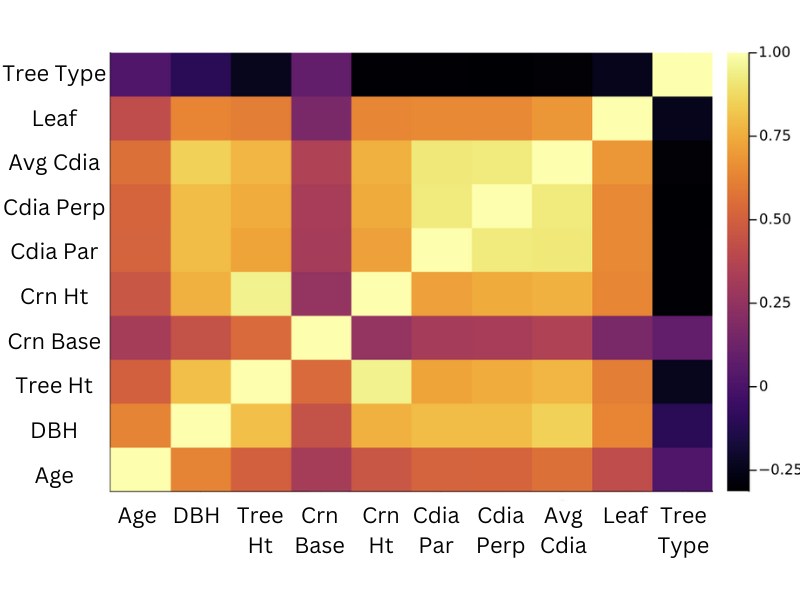

### Discussion and Conclusion

In summary, the variety of characteristics present in the raw tree data set posed quite a challenge when we approached a construction of a predictive model. Unfortunately, none of the three predictive models (decision tree, linear regression, and neural net) illustrated sufficient performance, though some were better than others, such as the linear regression model using four independent variables (tree age, average tree height, average leaf area, and average crown diameter) and the simple neural network using one input variable (DBH) to predict one output variable (TreeHt). Interestingly, this presents a general pattern: by increasing the number of independent variables used in any of the models, predictive performance improves slightly and the model errors decrease.

Moreover, existing correlations among the tree characteristics were revisited to reveal any potential confounding impacts on the predicted ouput. Refering to @fig:Ru_Final_heatmap, no strong correlations exist among the variables except with themselves. Some weak correlations -- visualized by a light orange-yellow color -- exist between TreeHt and DBH, CrnHt and DBH, CDiaPar and DBH, CDiaPerp and DBH, and AvgCdia and DBH with correlations in the 0.70-0.75 range. This implies that few to no confounding variables exist among the input variables. Instead, a slight correlation exists between the main input (DBH) and output variables studied, which supports the predictive capability of the model.

{#fig:Ru_Final_heatmap width=6in}

Finally, zooming out of the technical analyses in the report, we look into the question of why raw tree data was difficult to use in a prediction model and what might be done in the future to more meaningfully study tree characteristics in the context of applications to city planning, forest management, or general research. Regarding the regression-based and decision tree predictive models, a potential reason for a lack in predictive success is because of the raw tree data itself. Simple tree characteristics such as height, diameter, leaf area, etc., lack detail about potentially more important information such as soil, temperature, or environmental conditions that could reveal how a tree might respond to nearby stressors. For example, if information about soil moisture, local temperature, or vicinity to a fire or pollutive roadway were associated in a dataset with raw tree data, one might be able to predict more insightful relationships between the environment and a tree's growth or characteristic features. Raw tree data alone really only has the potential to illustrate correlational strength among tree characteristics grouped by certain features such as region or not grouped at all. And as we investigated, few substantial correlations exist among the raw tree characteristics.

Regarding the neural net model that tried to classify tree species (CommonName) and tree type, the variety of outputs (i.e., 157 tree names or 11 tree types) in comparison to the smaller number of input tree characteristics (i.e., 9 studied features) presents the reason for the lack in predictive performance. From a statistical standpoint, trying to predict more variables than are provided as inputs means a discrepancy between independent and dependent variable population sizes exists.

Ultimately, this report tried to extract as many meaningful relationships as it could from raw tree data and attempted several different types of predictive models. Although only moderate correlations were discovered and overall predictive performance was low, this report illustrates a thorough approach to data wrangling, exploration, and model creation. If the analyses presented in this report were to be investigated further in the future, we might consider collecting more environmental data and pairing it with raw tree characteristics to study something such as impacts of urban stressors on tree growth or health. These kinds of investigations could then be used to look into tree selection for  urban spaces that might be exposed to stressors such as lack of shade, hot temperatures, or urban traffic.

