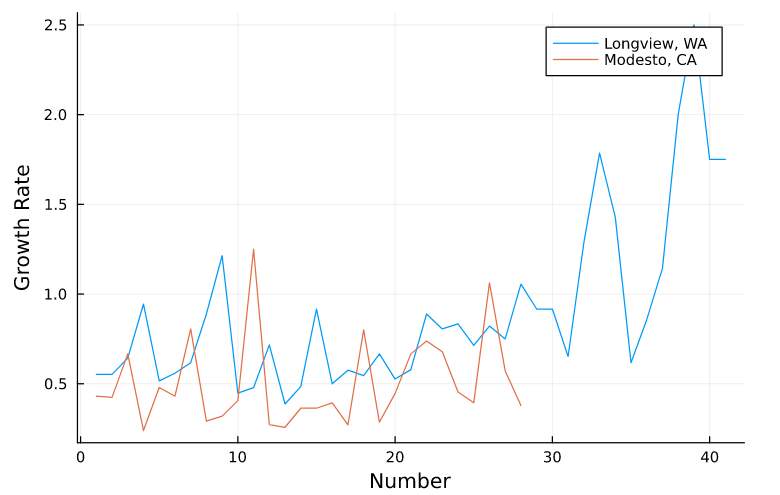

---
title: Analyzing the Correlations among Tree Characteristics and their Surroundings
keywords:
- markdown
- publishing
- manubot
lang: en-US
date-meta: '2022-11-19'
author-meta:
- Hadil Helaly
- Emma Golub
- Riley Blasiak
- Rupesh Rokade
header-includes: |-
  <!--
  Manubot generated metadata rendered from header-includes-template.html.
  Suggest improvements at https://github.com/manubot/manubot/blob/main/manubot/process/header-includes-template.html
  -->
  <meta name="dc.format" content="text/html" />
  <meta name="dc.title" content="Analyzing the Correlations among Tree Characteristics and their Surroundings" />
  <meta name="citation_title" content="Analyzing the Correlations among Tree Characteristics and their Surroundings" />
  <meta property="og:title" content="Analyzing the Correlations among Tree Characteristics and their Surroundings" />
  <meta property="twitter:title" content="Analyzing the Correlations among Tree Characteristics and their Surroundings" />
  <meta name="dc.date" content="2022-11-19" />
  <meta name="citation_publication_date" content="2022-11-19" />
  <meta name="dc.language" content="en-US" />
  <meta name="citation_language" content="en-US" />
  <meta name="dc.relation.ispartof" content="Manubot" />
  <meta name="dc.publisher" content="Manubot" />
  <meta name="citation_journal_title" content="Manubot" />
  <meta name="citation_technical_report_institution" content="Manubot" />
  <meta name="citation_author" content="Hadil Helaly" />
  <meta name="citation_author_institution" content="Department of Civil and Environmental Engineering" />
  <meta name="citation_author" content="Emma Golub" />
  <meta name="citation_author_institution" content="Department of Civil and Environmental Engineering" />
  <meta name="citation_author" content="Riley Blasiak" />
  <meta name="citation_author_institution" content="Department of Civil and Environmental Engineering" />
  <meta name="citation_author" content="Rupesh Rokade" />
  <meta name="citation_author_institution" content="Department of Civil and Environmental Engineering" />
  <link rel="canonical" href="https://uiceds.github.io/cee-492-term-project-fall-2022-her/" />
  <meta property="og:url" content="https://uiceds.github.io/cee-492-term-project-fall-2022-her/" />
  <meta property="twitter:url" content="https://uiceds.github.io/cee-492-term-project-fall-2022-her/" />
  <meta name="citation_fulltext_html_url" content="https://uiceds.github.io/cee-492-term-project-fall-2022-her/" />
  <meta name="citation_pdf_url" content="https://uiceds.github.io/cee-492-term-project-fall-2022-her/manuscript.pdf" />
  <link rel="alternate" type="application/pdf" href="https://uiceds.github.io/cee-492-term-project-fall-2022-her/manuscript.pdf" />
  <link rel="alternate" type="text/html" href="https://uiceds.github.io/cee-492-term-project-fall-2022-her/v/fbd74a838a23f6260dacebae6e2c244195595341/" />
  <meta name="manubot_html_url_versioned" content="https://uiceds.github.io/cee-492-term-project-fall-2022-her/v/fbd74a838a23f6260dacebae6e2c244195595341/" />
  <meta name="manubot_pdf_url_versioned" content="https://uiceds.github.io/cee-492-term-project-fall-2022-her/v/fbd74a838a23f6260dacebae6e2c244195595341/manuscript.pdf" />
  <meta property="og:type" content="article" />
  <meta property="twitter:card" content="summary_large_image" />
  <link rel="icon" type="image/png" sizes="192x192" href="https://manubot.org/favicon-192x192.png" />
  <link rel="mask-icon" href="https://manubot.org/safari-pinned-tab.svg" color="#ad1457" />
  <meta name="theme-color" content="#ad1457" />
  <!-- end Manubot generated metadata -->
bibliography:
- content/manual-references.json
manubot-output-bibliography: output/references.json
manubot-output-citekeys: output/citations.tsv
manubot-requests-cache-path: ci/cache/requests-cache
manubot-clear-requests-cache: false
...

<small><em>
This manuscript
([permalink](https://uiceds.github.io/cee-492-term-project-fall-2022-her/v/fbd74a838a23f6260dacebae6e2c244195595341/))
was automatically generated
from [uiceds/cee-492-term-project-fall-2022-her@fbd74a8](https://github.com/uiceds/cee-492-term-project-fall-2022-her/tree/fbd74a838a23f6260dacebae6e2c244195595341)
on November 19, 2022.
</em></small>

## Authors

+ **Hadil Helaly** 
    · {.inline_icon}
    [hadilhelaly](https://github.com/hadilhelaly) 
  <small>
     Department of Civil and Environmental Engineering
  </small>

+ **Emma Golub** 
    · {.inline_icon}
    [emmaagolub](https://github.com/emmaagolub) 
  <small>
     Department of Civil and Environmental Engineering
  </small>

+ **Riley Blasiak** 
    · {.inline_icon}
    [blasiak2](https://github.com/blasiak2) 
  <small>
     Department of Civil and Environmental Engineering
  </small>

+ **Rupesh Rokade** 
    · {.inline_icon}
    [RupeshRokade16](https://github.com/RupeshRokade16) 
  <small>
     Department of Civil and Environmental Engineering
  </small>

## Introduction

The Urban tree database, which was collected by the US Forest Service Research Archive of the US Department of Agriculture, includes data about tree growth in urban areas across 17 cities and 13 states over the span of 14-years (from 1998-2012). The states included in the study are: Arizona, California, Colorado, Florida, Hawaii, Idaho, Indiana, Minnesota, New Mexico, New York, North Carolina, Oregon, and South Carolina. The data come from measurements taken to over 14,000 street and urban park trees, and the data can be obtained by downloading the 1.08 MB compressed “data publication” file from [Link]( https://www.fs.usda.gov/rds/archive/catalog/RDS-2016-0005). Some measurements of interest include tree age, location, height, crown diameter, leaf area, foliar biomass, and utility line interference. Tree age, for example, was determined from interviews with residents, street construction dates, aerial and historical photos, the city’s urban forester, and laboratory cores developed by the Lamont-Doherty Earth Observatory’s Tree Ring Laboratory. 

The downloaded folder includes 9 data sheets in CSV format. The most interesting data files are 1. TS1_Regional_information.csv, 2. TS2_Regional_species_and_counts.csv, and 3. TS3_Raw_tree_data.csv. First, the “TS1_Regional_information.csv” file contains information about region code, city, state, airport codes, and collection year. Second, the “TS2_Regional_species_and_counts.csv” file contains information (columns) regarding region, scientific and common names of trees, tree type, and 9 columns of dbh_class, which represent a species diameter at breast height and are used to predict tree height, crown diameter, crown height, and leaf area. The file contains a total of 347 rows. Finally, the “TS3_Raw_tree_data.csv” file includes 14487 observations (rows) of raw tree data. For each observation, 41 different variables were collected (columns). A detailed description of each of these 41 variables is as followed:

- DbaseID = Unique id number for each tree.
- Region = 16 U.S. climate regions, abbreviations are used.
- City = City/state names where data collected.
- Source = Original *.xls filename (not available in this data publication).
- TreeID = Number assigned to each tree in inventory by city.
- Zone = Number/ID/name of the management area or zone that the tree is located in within a city; or nursery if young tree data collected there.
- Park/Street = Data listed as Park, Street, Regional Big Tree, or Nursery (for young tree measurements).
- SpCode = 4 to 6 letter code consisting of the first two letters of the genus name and the first two letters of the species name followed by two optional letters to distinguish two species with the same four-letter code (See \Data\TS2_Regional_species_and_counts.csv for a list of the SpCodes and corresponding scientific names.)
- ScientificName = Botanical name of species.
- CommonName = Common name of species.
- Tree Type = 3 letter code where first two letters refer to life form (BD=broadleaf deciduous, BE=broadleaf evergreen, CE=coniferous evergreen, PE=palm evergreen) and the third letter is mature height (S=small which is < 8 meters, M=medium which is 8-15 meters, and L=large which is > 15 meters).
- Address = From inventory, street number of building where tree is located.
- Street = From inventory, the name of the street the tree is located on. (NOTE: zero values denote data were not recorded in that city. These values were left unchanged because they originated from city inventories.)
- Side = From inventory, side of building or lot tree is located on (F=front, M=median, S=side, P=park). (NOTE: zero values denote data were not recorded in that city. These values were left unchanged because they originated from city inventories.)
- Cell = From inventory, the cell number (i.e., 1, 2, 3, …), where protocol determines the order trees at same address are numbered (e.g., driving direction or as street number increases).
- OnStreet = From inventory (omitted if not a field in city’s inventory), for trees at corner addresses when tree is on cross street rather than addressed street.
FromStreet = From inventory, the name of the first cross street that forms a boundary for trees lining un-addressed boulevards. Trees are typically numbered in order (1, 2, 3 …) on boulevards that have no development adjacent to them, no obvious parcel addresses.
- ToStreet = From inventory, the name of the last cross street that forms a boundary for trees lining un-addressed boulevards.
- Age = Number of years since planted. (NOTE: zero values represent newly planted trees, < 1 year old.)
- DBH (cm) = Diameter at breast height (1.37 meters [m]) measured to nearest 0.1 centimeters (tape). For multi-stemmed trees forking below 1.37 m measured above the butt flare and below the point where the stem begins forking, as per protocol.
- TreeHt (m) = From ground level to tree top to nearest 0.5 m (omitting erratic leader).
- CrnBase (m) = Average distance between ground and lowest foliage layer to nearest 0.5 m (omitting erratic branch).
- CrnHt (m) = Calculated as TreeHT minus Crnbase to nearest 0.5 m. (NOTE: zero values indicate no live crown was present, hence no other tree dimension data were available.)
- CdiaPar (m) = Crown diameter measurement taken to the nearest 0.5 m parallel to the street (omitting erratic branch).
- CDiaPerp (m) = Crown diameter measurement taken to the nearest 0.5 m perpendicular to the street (omitting erratic branch).
- AvgCdia (m) = The average of crown diameter measured parallel and perpendicular to the street.
- Leaf (m2) = Estimated using digital imaging method to nearest 0.1 squared meter (m2).
- Setback = Distance from tree to nearest air-conditioned/heated space (may not be same address as tree location): 1=0-8 m, 2=8.1-12 m, 3=12.1-18 m, 4=> 18 m.
- TreeOr = Taken with compass, the coordinate of tree taken from imaginary lines extending from walls of the nearest conditioned space (may not be same address as tree location).
- CarShade = Number of parked automotive vehicles with some part under the tree's drip line. Car must be present (0=no autos, 1=1 auto, etc.).
- LandUse = Predominant land use type where tree is growing (1=single family residential, 2=multi-family residential [duplex, apartments, condos], 3=industrial/institutional/large commercial [schools, gov't, hospitals], 4=park/vacant/other [agric., unmanaged riparian areas of greenbelts], 5=small commercial [minimart, retail boutiques, etc.], 6=transportation corridor).
- Shape = Visual estimate of crown shape verified from each side with actual measured dimensions of crown height and average crown diameter (1=cylinder [maintains same crown diameter in top and bottom thirds of tree], 2=ellipsoid, the tree's center [whether vertical or horizontal is the widest, includes spherical], 3=paraboloid [widest in bottom third of crown], 4=upside down paraboloid [widest in top third of crown]).
- WireConf = Utility lines that interfere with or appear above tree (0=no lines, 1=present and no potential conflict, 2=present and conflicting, 3=present and potential for conflicting). (NOTE: -1 denotes data were not collected.)
- dbh1 = Dbh (centimeters [cm]) for multi-stemmed trees; for non-multi-stemmed trees, dbh1 is same as Dbh (cm).
- dbh2 = Dbh (cm) for second stem of multi-stemmed trees.
- dbh3 = Dbh (cm) for third stem of multi-stemmed trees.
- dbh4 = Dbh (cm) for fourth stem of multi-stemmed trees.
- dbh5 = Dbh (cm) for fifth stem of multi-stemmed trees.
- dbh6 = Dbh (cm) for sixth stem of multi-stemmed trees.
- dbh7 = Dbh (cm) for seventh stem of multi-stemmed trees.
- dbh8 = Dbh (cm) for eight stem of multi-stemmed trees.

Additionally, a fourth data set may be of later interest for estimating leaf area, species dominance at a spatial scale, and carbon storage estimates. The TS5_Foliar_biomass_leaf_samples.csv contains urban foliar samples data by species for 17 U.S. cities. A total of 261 rows are provided.

The breadth of this dataset allows for a myriad of problems to be explored. The primary data that will be utilized for this project is the “TS3_Raw_tree_data.csv” file, as this contains the most columns which will result in more feasible predictions during the machine learning portion of the project. This data can be used to analyze correlations between tree characteristics and their surroundings. One potential research question using the “TS3_Raw_tree_data.csv” file is: how does utility line interference affect the growth of a certain type of tree in one state versus a different state. the preliminery 14 variables that can be used in the proposed analysis include "Address", "Age", "Shape", "WireConf", "Setback","CarShade", "DBH", "TreeHt", "CrnBas" "CrnHt", "CdiaPar", "CDiaPerp", "AvgCdia", "Leaf".

After tidying the dataset, we can compare the effect of the WireConf, Setback, CarShade on the remaining variables of similar trees. Since we also contain the addresses of the trees, along with visualizing graphs from results of the comparisons, we can create maps to understand the variance of these effects across different cities. Further, a machine learning model can be created to possibly target and predict the above results for a city that is not mentioned in the dataset and predict the missing values in the dataset.

## Exploratory Data Analysis

Tree growth depends on many factors, some of which are included in this dataset, while others are outside the scope of this work. Resulting from the following data analysis, different regions were found to have trees of the same species and ages, but variable heights. This can be attributed to climate specific variables such as yearly temperature, precipitation, flooding, and even wind speeds [1]. Variables within the scope of this project that could have an impact on tree growth include: power line interference, setback from conditioned spaces, and land use. Additionally, variables describing tree growth such as diameter at breast height, leaf volume, tree height, and tree age also depend on one another [2,3].

Throughout this exploratory analysis, four main questions were developed to guide data exploration, which involved data wrangling to produce visualizations of potential correlations among selected variables of interest. These questions are as follows:

1. How does setback (tree distance from heated/air-conditioned spaces) show in different cities and/or regions? (i.e., correlation with tree height and location)

2. How does growth rate (i.e., height per age of tree) differ for each region, land use, city, etc.?

3. How do power lines impact the growth of trees? (i.e., number of trees, leaf area, tree height, power lines)

4.  What are the correlations between tree type, land use, height, leaf area, car shade, DBH, CdiaPar, and CDiaPerp for urban tree planning by region and/or city? 

Initially, setback was investigated to understand the effects it has on the height of trees. Setback is defined as the distance from the tree to the nearest air-conditioned or heated space (which may not be the same address as the tree location), with values of 1,2,3,4, which are defined as 0m to 8m, 8.1m to 12m, 12.1m to 18m, and > 18m, respectively. . After filtering out all the missing values from the dataset, a bar graph was plotted for the mean setback across various locations. (Figure @fig:Ru_Mean_setback_cropped)

{#fig:Ru_Mean_setback_cropped width=5in}

It was identified that the cities with the highest mean setback in descending order are 1) Albuquerque (3.80385), 2) Glendale (3.56843), 3) Charlotte (3.06892), and 4) Longview (2.92153). Similarly, the cities with least mean setback in ascending order are 1) Queens, (2.01564), 2) Claremont (2.17143), 3) Berkeley (2.28313), and 4) Indianapolis (2.31699).
Next, similar tree species from the top four mean setback values and bottom four mean setback values were identified. This helped to establish a similar medium for tree height comparison. However, it was found that no common species were present between the two groups. Therefore, a random city (Charlotte) was analyzed, where similar species having the same age were grouped together.

{#fig:Ru_SilverMaple_age35_setback_2-3 width=5in}

{#fig:Ru_RiverBirch_age15_setback_3-4 width=5in}

Using their mean heights, it was observed that setback and tree height presented no correlation as seen in the following 2 cases:

1) Silver Maple trees of age 35 with Setback of 2 and 3. (Figure @fig:Ru_SilverMaple_age35_setback_2-3)

2) River Birch trees of age 15 with Setback of 3 and 4. (Figure @fig:Ru_RiverBirch_age15_setback_3-4)

Next, the tree height parameter was explored by selecting two random cities - Longview, WA and Modesto, CA, and the species that were selected due to their existence in both locales were - Sweetgum, Cherry Plum, and European White Birch. 

{#fig:Ri_Sweetgum_GrowthRate width=5in}

Figure @fig:Ri_Sweetgum_GrowthRate shows that in Longview, WA, Sweetgum trees are taller than Modesto, CA trees at any age.

{#fig:Ri_Cherry_hiVSage width=5in}

Figure @fig:Ri_Cherry_hiVSage shows that in Longview, WA, Cherry Plum trees are taller than Modesto, CA trees at any age.

{#fig:Ri_Euro_hiVSage width=5in}

Figure @fig:Ri_Euro_hiVSage shows that in Longview, WA, European Birch trees are taller than Modesto, CA trees at any age.

Next, the growth rate (Tree Height / Age) vs Tree ID yielded the following graph:

{#fig:Ri_Euro_GrowthRate width=5in}

This figure shows that the growth rate is not constant for one tree type, and may vary throughout the tree's lifetime. Here it can be seen that generally, the growth rate in Longview, WA is greater than that of Modesto, CA.

These figures illustrate a relationship between location and height of trees. This relationship may be attributed to different temperature, precipitation, or other factors outside of the dataset.

To further understand the differences for tree height across all the locations in the dataset, a barplot of tree heights grouped by species was produced over all locations to study typical heights associated with each tree type. From Fig @fig:E_TreeHt_Species_barplot, one can observe how some trees (i.e., blue gum eucalyptus, valley oak) present the highest tree heights compared to others, such as the common crapemyrtle or the pinyon pine, which present much smaller heights. City planners might use this information to decide which trees to include in their city landscape plans.

{#fig:E_TreeHt_Species_barplot width=5in}

Then, barplots of tree height by city and region were investigated to develop a deeper understanding of spatial tree height distributions. The following figures present how the average tree height varies by city and region.

{#fig:E_TreeHt_City_barplot width=5in}

{#fig:E_TreeHt_Region width=5in}

From these figures, it can be observed that there are distinct spatial differences among tree height distributions. For example, trees tend to be taller in more mountainous regions and shorter in desert regions, and this aligns well with the results observed in Fort Collins, CO and Albuquerque, NM, respectively.

Moreover, an exploration of the presence of utility lines and their impact on the growth of trees was conducted. For this analysis, four variables were selected and filtered to find the correlation between the presence of utility lines and the growth of trees. These variables include “WireConf,” “Age,” “TreeHt,” and “DBH.” The “WireConf” variable is a categorical variable that presents whether the utility lines interfere with or appear above a tree. This variable might include one of five values: 0= no lines, 1= lines present and with no potential conflict, 2= lines present and conflicting, and 3= lines present with potential for conflicting, while any values with “-1” denote data that was not collected. The “Age” variable is a numerical variable that presents the number of years since the tree was planted. The “TreeHt (m)” variable is a numerical variable that presents tree height from ground to the treetop to the nearest 0.5 m. The “DBH” variable is a numerical variable that presents the diameter of the tree at breast height (1.37 meters [m]) measured to the nearest 0.1 centimeters.

The first step in analyzing the effect of wire conflict on the dataset was to group the data by “WireConf” to discover how many trees in the database were affected. Figure @fig:numberoftrees shows the percentage of trees in the database in each category after excluding all trees that do not have data. Figure @fig:numberoftrees shows that 71% of trees in the database are not in areas that have utility lines conflicting with them, which will help to compare tree growth when no utility lines are present vs when utility lines are present. 

{#fig:numberoftrees width=5in}

The second step was to calculate the average height of trees for each of the aforementioned categories as shown in Figure @fig:averegeheight. The average tree height in all categories varies from 10 to 13 meters, which does not clarify the impact of the growth of trees with the presence of the utility lines. Therefore, further investigation is needed.

{#fig:averegeheight width=5in}

The third step was to find the correlation between the age and the height of trees for each of the aforementioned categories. Figure @fig:h_avgHeight_age shows that there is a strong correlation between tree age and average tree height in all categories. The calculated correlation in all categories is higher than 0.7. Additionally, in all categories, the correlation is almost the same under the age of 50 years then, it started to be slightly different in each category as shown in Figure @fig:h_avgHeight_age_all. 

{#fig:h_avgHeight_age width=7.5in}

{#fig:h_avgHeight_age_all width=6in}

The fourth step was to analyze the correlation between the average diameter of a tree and its age in each category. Figure @fig:h_avgDBH_age shows that there is a moderate-to-strong correlation between the average DBH and tree age in all categories. The calculated correlation in all categories is higher than 0.8, see Figure @fig:h_avgDBH_age_all.

{#fig:h_avgDBH_age width=7.5in}

{#fig:h_avgDBH_age_all width=6in}

The last step was to find the correlation between the height and diameter of trees to validate its use in estimating the tree height based on its diameter. Figure @fig:h_cor_age_avgDBH presents the correlation between the two aforementioned variables. The figure shows a moderate correlation between tree height and its diameter, and the calculated correlation is 0.78.

{#fig:h_cor_age_avgDBH width=6in}

Therefore, the presence of utility lines does not have a great impact on the growth of trees. 

Next, the relationships among tree species, tree height, land use, and location were explored to identify any plausible correlations for the purpose of urban tree planning. One may consider how urban city planners select particular species of tree to plant within specific land use types. For example, perhaps an urban planner might select a particular tree species based on average height or canopy size (leaf area) in order to provide suitable landscaping along a street and provide sufficient shade to city goers without intercepting overhead telephone lines or buildings. Furthermore, these data were grouped by city and region to investigate spatial differences among the variables. 

Next, a bar plot depicting the average land use (which was calculated by rounding the mean land use type across species, where land use contains the following categories: 1=single family residential, 2=multi-family residential, 3=industrial/institutional/large commercial, 4=park/vacant/other, 5=small commercial, 6=transportation corridor) was created to visualize which species might be more commonly associated with a land use type. Based on the results in Fig. @fig:E_MeanLandUse_Species_barplot, it appears that some tree species are more frequently linked to specific land use types (i.e., evergreen ash trees to small/commercial land uses or both willow acacia and japanese maple to single family residential land uses).

{#fig:E_MeanLandUse_Species_barplot width=5in}

Additionally, the correlations among tree height, DBH, crown height, and leaf area were explored to illustrate quantitative factors that urban planners might consider when redesigning a site. Moreover, the US Forest Service Research Archives, from which the raw tree data was obtained, describes how variables such as tree age can be used to predict a species diameter at breast height (dbh), which can in turn predict tree height, crown diameter, crown height, leaf area, and tree age [2]. Extending the investigation to include these considerations, tree height, DBH, crown height, and leaf area variables were selected and their correlations were calculated. The following graphs depict marginal histograms, which are useful in explaining the distributions of each variable as well as how they are correlated.

{#fig:E_MargHist_DBH_Ht width=5in}

{#fig:E_MargHist_DBH_CrownHt width=5in}

{#fig:E_MargHist_LeafArea_DBH width=5in}

{#fig:E_Corrplot width=5in}

To investigate these above relationships further, average DBH by tree heights was grouped by cities to illustrate how the two variables are related in different cities. The following figures visualize these relationships and show a moderate-to-strong positive correlation between average DBH and tree height across different cities. Several cities were randomly chosen out of all available cities. The correlations between average DBH and tree height are also listed below.

{#fig:E_TreeHt_AvgDBH_CitiesSubplots_Scatter width=5in}

{#fig:E_TreeHt_AvgDBH_Cities_Scatter width=5in}

Correlation Coefficients:

1) DBH vs Tree Height Overall: 0.802

2) DBH vs Tree Height for randomly chosen cities:

    Santa Monica, CA: 0.713

    Berkeley, CA: 0.889

    Fort Collins, CO: 0.959

    Longview, WA: 0.933

    Boise, ID: 0.985

    Queens, NY: 0.970

    Leaf Area vs DBH: 0.713

3) DBH vs Crown Base Height: 0.422

In summary, this exploratory analysis has shown both strong and insignificant correlations among raw tree data variables. The relationship between tree height and setback revealed insignificant correlation , while moderate-to-strong correlations between tree age and both height and diameter of tree exist. Additionally, correlation between tree age and its diameter is stronger than that of tree age and height. Overall, relationships among tree size and tree growth are significant because they can be used by urban forest managers, landscape architects, and city planners to select suitable trees given limited growing space or an intended purpose. Predicting the most suitable trees for a site has the potential to reduce costly future conflicts between trees and infrastructure [2]. 

## Predictive Modeling

Based on some of the above correlations and supporting evidence from the US Forest Service Research Archives [2], there are strong correlation between diameter at breast heights (dbh) and tree age, tree height, leaf area, crown height, and average crown diameter. 
Therefore, several predictive models using 3 different machine learning techniques were explored to select the most suitable model to predict (dbh) based on the aforementioned variables. Those techniques include (1) decision-tree algorism, (2) regression, and (3) neural networks. To enable a reliable performance evaluation procedure, the collected data was divided into two separate datasets for each developed predictive model: (1) training dataset that includes 70% of all the available data that will be used in developing the model, and (2) testing dataset that includes 30% of all available data that will be used for evaluating the performance of the developed model. The following three sections provide a detailed description of these aforementioned 3 machine learning techniques.

### Decision-Tree Algorithm 

This model was run with two to five independent variables in order to predict DBH. The output of these iterations are as follows:

{#fig:DT_AgeHt width=3in}

{#fig:DT_AgeHtLeaf width=3in}

{#fig:DT_AgeHtLeafCrnHt width=3in}

{#fig:DT_AgeHtLeafCrnHtCdia width=3in}

With each addition of independent variables, the mean coefficient of determination increased, and the mean squared error decreased. Overall the decision tree model for this data is not robust and does not do a great job at fitting the data. The correlation coefficient gets increasingly closer to one with additional variables, meaning the linear relation is better with more variables and DBH than a few variables and DBH. This finding shows that a linear regression model might be a better method for modeling this dataset.

### Regression

This technique depends on developing multiple linear regression model between the dependent variable and independent variables. Starting with a simple regression model that include only one independent variable (tree age) to predict the dependent variable (average dbh). The predictive formula is used to calculate the coefficient of determination, Root Mean Square Error (RMSE), and model accuracy. As shown in Figure @fig:Reg_model1, the model achieved R squared of 74%, Root Mean Square Error (RMSE) of 21.12, and accuracy of 12.4%. 

{#fig:Reg_model1 width=7in}

Further investigation was performed to determine why the accuracy is low. After plotting average dbh in y-axis and age in the x-axis for training and testing datasets. Two data points were determined to be outliers, as shown in Figure @fig:Reg_model1_plot)

{#fig:Reg_model1_plot width=5in}

The second model was performed using the same dependent and independent variables after excluding outliers’ data point. The model achieved R squared of 88%, RMSE of 10.91, and accuracy of 87%, as shown in Figure @fig:ig:Reg_Model2

{#fig:Reg_Model2 width=7in}

The third model was performed using two independent variables: tree age and average tree height. The model achieved R squared of 94%, RMSE of 8.08, and accuracy of 92%, as shown in Figure @fig:ig:Reg_Model3

{#fig:Reg_Model3 width=7in}

The fourth model was performed using three independent variables: tree age, average tree height, and average leaf area. The model achieved R squared of 95%, RMSE of 9.01, and accuracy of 92%, as shown in Figure @fig:ig:Reg_Model4

{#fig:Reg_Model4 width=7in}

The fifth model was performed using four independent variables: tree age, average tree height, average leaf area, and average crown diameter. The model achieved R squared of 93%, RMSE of 7, and accuracy of 94.5%, as shown in Figure @fig:ig:Reg_Model5

{#fig:Reg_Model5 width=7in}

Based on the above analysis, the best model that achieved the lowest RMSE and highest accuracy is model 5.

## References {.page_break_before}

<!-- Explicitly insert bibliography here -->

[1] Oregon State University. 2022. Environmental factors affecting plant growth. OSU Extension Service. https://extension.oregonstate.edu/gardening/techniques/environmental-factors-affecting-plant-growth#:~:text=Environmental%20factors%20that%20affect%20plant,affect%20plant%20growth%20and%20development 

[2] McPherson, E. Gregory; van Doorn, Natalie S.; Peper, Paula J. 2016. Urban tree database. Fort Collins, CO: Forest Service Research Data Archive. Updated 21 January 2020. https://doi.org/10.2737/RDS-2016-0005

[3] Kuuluvainen, T., Mäki, J., Karjalainen, L., & Lehtonen, H. (2002). Tree age distributions in old-growth forest sites in Vienansalo Wilderness, eastern fennoscandia. Silva Fennica, 36(1). https://doi.org/10.14214/sf.556 